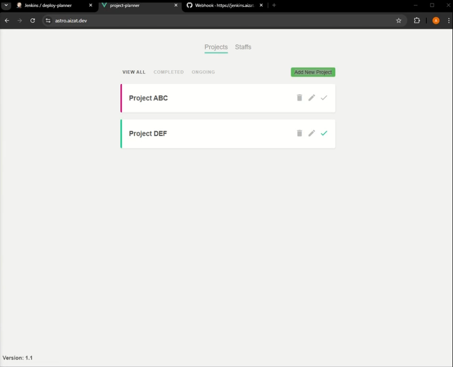

# Devops Project Planner

Sample Project Planner application deployed as a containerized solution. It demonstrates the use of Jenkins Pipeline-as-Code for automating the build and deployment of the application.



### Installation

First, clone the repository to your local machine:

```
  git clone https://github.com/aizatnazran/devops-project-planner.git
```

## Run Locally

Go to the project directory

```bash
  cd devops-project-planner
```

Install dependencies in all directories

```bash
  npm run install-all
```

Start the application

```bash
  npm start
```

Accessing the application

[http://localhost:8080/](http://localhost:8080/)
